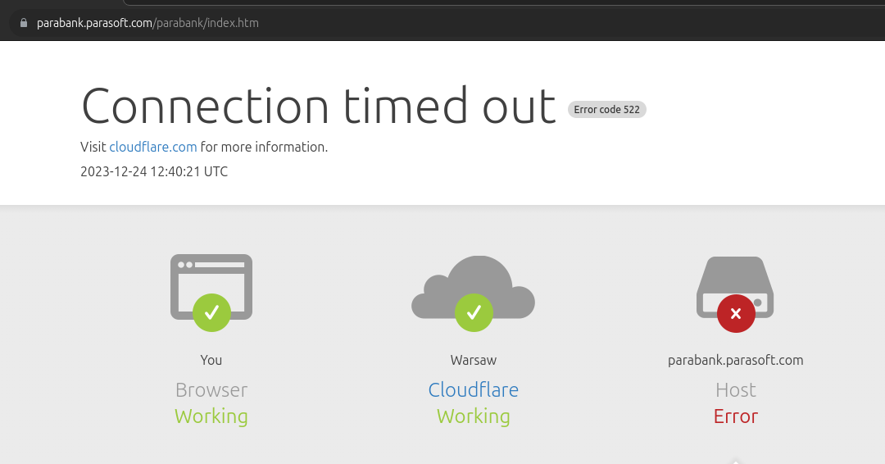

**Issue ID**: PB-001

**Priority**: High

**Date**: 24-12-2023 13:39 

**Title**: Inaccessibility of the parabank.parasoft.com Website

**Severity**: Critical

**Status**: New

**Description**:
Attempting to access the parabank.parasoft.com website results in a failure to load, with an error message being displayed to the user. This issue occurs across different browsers (Chrome, Firefox, Safari) and on various devices. The problem was first noticed on [date] at around [time].

**Steps to Reproduce**:
1. Open a web browser.
2. Enter the URL: http://parabank.parasoft.com
3. Observe the result.

**Expected Result**:
The website loads correctly, allowing access to Parabank's features.

**Actual Result**:
The website fails to load, displaying an error message (e.g., "Cannot establish a connection").

**Evidence**:

**Environment**:
- Operating System: Ubuntu 23
- Browser: Chrome
- Connection Type: Wi-Fi

**Reporter**: Bogusz Mędykowski

